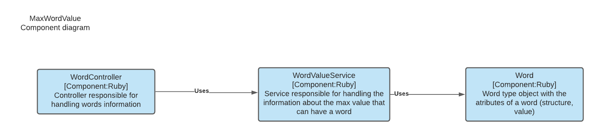
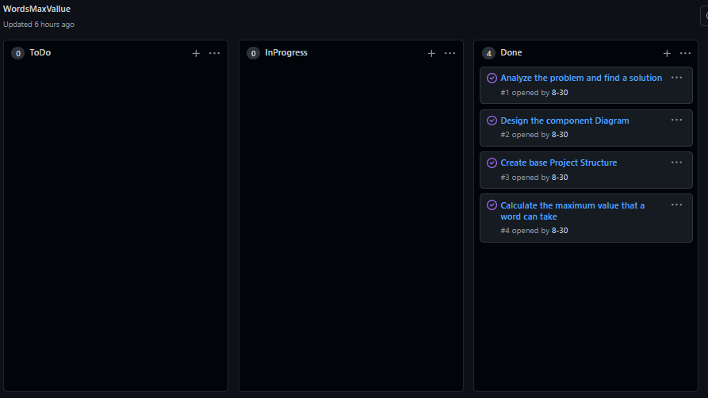

This following program is the solution for a Challenge

Contents
========
 * [Run](#run)
 * [Arquitecture](#arquitecture)
 * [Approach and Methodology](#approach-and-methodology)


## Run

To run the application use
```sh
ruby index.rb
```

## Arquitecture

The functional structure of the program was modeled using the c4 model components diagram


## Approach and Methodology

For exercise development first I read the problem carefully until I found a possible solution, then I translated the solution in pseudo code to check if it would be useful, once my solution was verified I proceeded to design the component diagram and finally assemble the project structure and implement the solution.

I Manage all my tasks using a proyect within the github repository created for the exercise.

